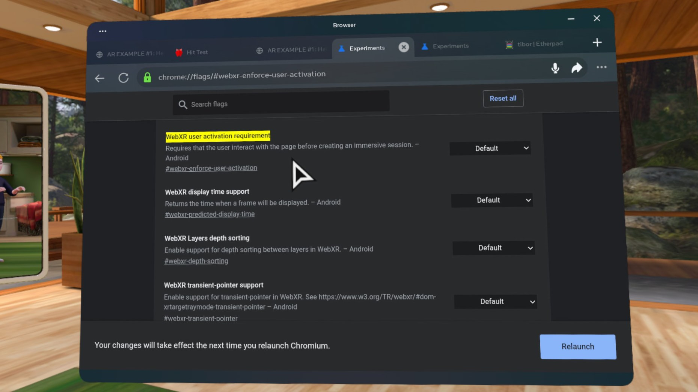

## Avoiding the Enter XR Button


Usually, you must press a button before starting an immersive AR or VR session. This is a security measure to prevent websites from overwhelming users. However, pressing this button each time you want to test a change in your code can be tedious. 

By default, p5.xr `createCanvas` will attempt to launch the session without requiring the button press. If you use the [Immersive Web Emulator](quick-start/emulator.md) or have turned off the webxr-enforce-user-activation flag in your XR device browser, this will work directly. Otherwise, you must click the button to launch the interactive session.

```javascript
function setup() {
    createCanvas(windowWidth, windowHeight, AR);
} 
```

If you want to see the button while coding, you can launch the session like below.

```javascript
function setup() {
    createCanvas(windowWidth, windowHeight, AR_BUTTON);
} 
```

To allow sketches to launch directly on your XR device browser, navigate to `chrome://flags/#webxr-enforce-user-activation` and disable that flag. Note that this option may not be available in all browsers.


